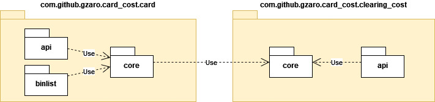

= Card Cost sample service

Using this service you can set the card clearing cost per country and you can query for clearing cost of a given card. Full API specification can be found link:./src/main/resources/static/api-docs.yaml[here]. The specification file is also served in path _/api-docs.yaml_ of a running instance.

== Buildind and running docker image

.Build
[source,bash]
----
./gradlew bootBuildImage
----

.Run
[source,bash]
----
docker run -p 8080:8080 card-cost-gzaro:latest
----

== Structure

There are two main packages _clearing_cost_ which contains the code for getting and updating clearing cost per country and _card_ which contains the card cost calculation.

== Testing

The service does not implement any significant business logic, so there are no unit tests. Most important end to end tests have been implemented using wiremock for stubbing external service responses.

== Notes

- Local H2 database file is used for clearing cost matrix. In a production environment a real DBMS should be used.
- Database schema is simple and does not support full CRUD operations.
- Caching of external service responses could be used.
- Using a fixed-size cache with TTL could probably be used for limiting external requests (5 per hour for free tier).